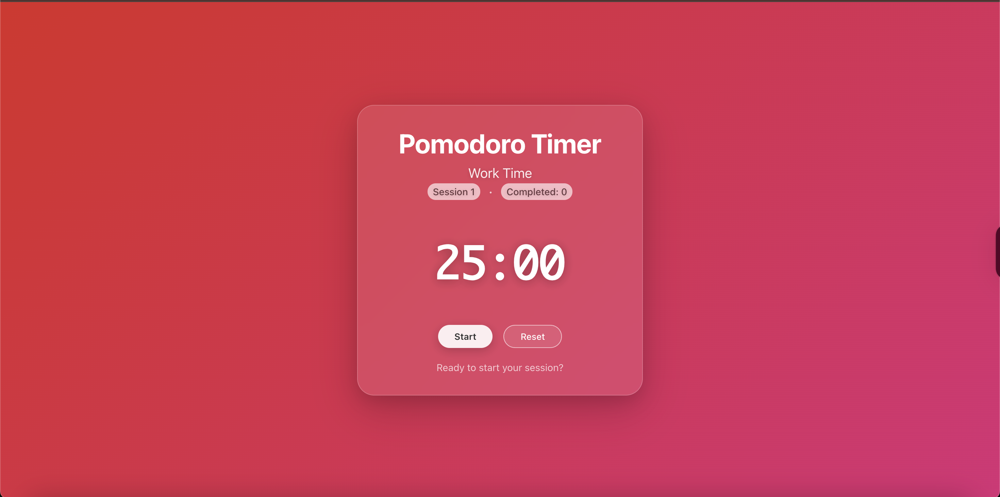

# Pomodoro Timer Web App

A simple, modern Pomodoro Timer built with React. Stay focused and boost your productivity using the Pomodoro Technique: alternate between focused work sessions and short breaks, with a longer break after every four sessions.

## Features

- **Customizable Timer**: 25-minute work sessions, 5-minute short breaks, and 15-minute long breaks (after every 4 sessions)
- **Session Tracking**: See your current session and how many sessions you've completed
- **Responsive UI**: Clean, user-friendly interface
- **Start, Pause, and Reset**: Full control over your timer
- **Status Indicator**: Visual cues for work, break, and completion

## Screenshots



## Getting Started

### Prerequisites
- [Node.js](https://nodejs.org/) (v14 or newer recommended)
- [npm](https://www.npmjs.com/) (comes with Node.js)

### Installation

1. **Clone the repository:**
   ```bash
   git clone https://github.com/yourusername/pomodoro-web-app.git
   cd pomodoro-web-app
   ```
2. **Install dependencies:**
   ```bash
   npm install
   ```
3. **Start the development server:**
   ```bash
   npm start
   ```
   The app will open at [http://localhost:3000](http://localhost:3000).

## Usage

- Click **Start** to begin a work session.
- The timer will count down from 25 minutes (default).
- When the timer reaches 0, you'll automatically switch to a break.
- After every 4 work sessions, enjoy a longer 15-minute break.
- Use **Pause** to stop the timer, and **Reset** to restart the current session.

## Customization

You can adjust timer durations and session logic in `src/App.jsx` if you want to personalize your workflow.

---

*Made using React.*
